## STAT-109 Intro to Statistical Modeling - Final Project

#### Contributors : [Phillip Booth](mailto:phillip.booth2015@gmail.com), [Eliud Omollo](woordy2000@gmail.com) , [Jack Carter](jcarter2014@gmail.com), [Vivek Mishra](mailto:iblpvivek@icloud.com)

<HR>

### [Welcome](readme.md)&emsp;|&emsp;[Data Set](data-set.md)&emsp;|&emsp;[**_Introduction and EDA_**](eda.md)&emsp;|&emsp;[Model Building](model-building.md)&emsp;|&emsp;[Summary](summary.md)

<HR>


## Content:
- [Data Resources](#data-resources)
- [EDA](#eda) 
  * [Sample Data](#sample-data) <BR>
  * [Rename Columns](#rename-columns) <BR>
  * [Train Test Split](#train-test-split) <BR>
  * [Missing Data](#missing-data) <BR>
  * [Impute Missing Values](#impute-the-missing-values)<BR>
  * [Number of Agencies By State](#number-of-agencies-by-state) <BR>
  * [Top 15 Cities with most Agencies](#top-15-cities-with-most-agencies) <BR>
  * [Number of Episodes By State](#number-of-episodes-by-state) <BR>
  * [Number of Episodes By City](#number-of-episodes-by-city) <BR>
  * [Expected Amount Vs Total Episodes](#expected-amount-vs-total-episodes) <BR>
  * [Number of Males and Females by State](#number-of-males-and-females-by-state) <BR>
  * [Geoplots](#geoplots) <BR>
  * [Correlation Plots](#correlation-plots) <BR>
  * [Scatter Plots](#ccatter-plots) <BR>
 
- [Key Features](#key-features)

<HR>

### Data Resources

We have aleady got the complete data set from federal gov website, now we will split them into train and test data and run all the analysis on that data.


### EDA

#### Sample data

<table border="1" class="dataframe">
  <thead>
    <tr style="text-align: right;">
      <th></th>
      <th>Provider ID</th>
      <th>Agency Name</th>
      <th>Street Address</th>
      <th>City</th>
      <th>State</th>
      <th>Zip Code</th>
      <th>Total Episodes (non-LUPA)</th>
      <th>Distinct Beneficiaries (non-LUPA)</th>
      <th>Average Number of Total Visits Per Episode (non-LUPA)</th>
      <th>Average Number of Skilled Nursing Visits Per Episode (non-LUPA)</th>
      <th>...</th>
      <th>Percent of Beneficiaries with COPD</th>
      <th>Percent of Beneficiaries with Depression</th>
      <th>Percent of Beneficiaries with Diabetes</th>
      <th>Percent of Beneficiaries with Hyperlipidemia</th>
      <th>Percent of Beneficiaries with Hypertension</th>
      <th>Percent of Beneficiaries with IHD</th>
      <th>Percent of Beneficiaries with Osteoporosis</th>
      <th>Percent of Beneficiaries with RA/OA</th>
      <th>Percent of Beneficiaries with Schizophrenia</th>
      <th>Percent of Beneficiaries with Stroke</th>
    </tr>
  </thead>
  <tbody>
    <tr>
      <th>0</th>
      <td>17008</td>
      <td>JEFFERSON COUNTY HOME CARE</td>
      <td>2201 ARLINGTON AVENUE</td>
      <td>BESSEMER</td>
      <td>AL</td>
      <td>35020</td>
      <td>133</td>
      <td>54</td>
      <td>11.6</td>
      <td>7.4</td>
      <td>...</td>
      <td>0.16667</td>
      <td>0.18519</td>
      <td>0.57407</td>
      <td>0.44444</td>
      <td>NaN</td>
      <td>0.29630</td>
      <td>0.00000</td>
      <td>0.48148</td>
      <td>0.27778</td>
      <td>0.07407</td>
    </tr>
    <tr>
      <th>1</th>
      <td>17009</td>
      <td>ALACARE HOME HEALTH &amp; HOSPICE</td>
      <td>2970 LORNA ROAD</td>
      <td>BIRMINGHAM</td>
      <td>AL</td>
      <td>35216</td>
      <td>12879</td>
      <td>6616</td>
      <td>18.9</td>
      <td>9.2</td>
      <td>...</td>
      <td>0.38316</td>
      <td>0.39389</td>
      <td>0.45118</td>
      <td>0.67427</td>
      <td>NaN</td>
      <td>0.56439</td>
      <td>0.13286</td>
      <td>0.64631</td>
      <td>0.05230</td>
      <td>0.12757</td>
    </tr>
    <tr>
      <th>2</th>
      <td>17013</td>
      <td>GENTIVA HEALTH SERVICES</td>
      <td>1239 RUCKER BLVD</td>
      <td>ENTERPRISE</td>
      <td>AL</td>
      <td>36330</td>
      <td>1236</td>
      <td>612</td>
      <td>23.4</td>
      <td>8.5</td>
      <td>...</td>
      <td>0.32516</td>
      <td>0.38235</td>
      <td>0.45261</td>
      <td>0.66176</td>
      <td>NaN</td>
      <td>0.51144</td>
      <td>0.16503</td>
      <td>0.67157</td>
      <td>0.05229</td>
      <td>0.12745</td>
    </tr>
    <tr>
      <th>3</th>
      <td>17014</td>
      <td>AMEDISYS HOME HEALTH</td>
      <td>68278 MAIN STREET</td>
      <td>BLOUNTSVILLE</td>
      <td>AL</td>
      <td>35031</td>
      <td>685</td>
      <td>403</td>
      <td>21.4</td>
      <td>8.2</td>
      <td>...</td>
      <td>0.36476</td>
      <td>0.46898</td>
      <td>0.44417</td>
      <td>0.60794</td>
      <td>NaN</td>
      <td>0.54591</td>
      <td>0.12903</td>
      <td>0.67246</td>
      <td>0.08685</td>
      <td>0.17370</td>
    </tr>
    <tr>
      <th>4</th>
      <td>17016</td>
      <td>SOUTHEAST ALABAMA HOMECARE</td>
      <td>804 GLOVER AVENUE</td>
      <td>ENTERPRISE</td>
      <td>AL</td>
      <td>36330</td>
      <td>685</td>
      <td>362</td>
      <td>15.5</td>
      <td>8.5</td>
      <td>...</td>
      <td>0.40331</td>
      <td>0.35912</td>
      <td>0.52486</td>
      <td>0.69337</td>
      <td>NaN</td>
      <td>0.58287</td>
      <td>0.14917</td>
      <td>0.60773</td>
      <td>0.05249</td>
      <td>0.15193</td>
    </tr>
  </tbody>
</table>
<p>5 rows × 49 columns</p>
</div>

#### Shape 

```python
print('Number of rows: {} | Number of Columns: {}'.format(medicare_data.shape[0], medicare_data.shape[1]))
```
```python
Number of rows: 10139 | Number of Columns: 49
```

The dataset consists of 10139 rows and 49 columns

#### Rename Columns
We will rename the columns for easier manipulation

<table class="dataframe">
  <thead>
    <tr style="text-align: right;">    
      <th>Original Column Name</th>
      <th>New Column Name</th>
    </tr>
  </thead>
  <tbody>
    <tr>      
      <td>Provider ID</td>
      <td>provider_id</td>  
    </tr> 
   <tr>      
      <td>Agency Name</td>
      <td>agency</td>  
    </tr> 
   <tr>      
      <td>Street Address</td>
      <td>address</td>  
    </tr> 
   <tr>      
      <td>City</td>
      <td>city</td>  
    </tr> 
   <tr>      
      <td>State</td>
      <td>state</td>  
    </tr> 
   <tr>      
      <td>Zip Code</td>
      <td>zip_code</td>  
    </tr> 
   <tr>      
      <td>Total Episodes (non-LUPA)</td>
      <td>total_episodes</td>  
    </tr> 
   <tr>      
      <td>Distinct Beneficiaries (non-LUPA)</td>
      <td>distinct_beneficiaries</td>  
    </tr> 
   <tr>      
      <td>Average Number of Total Visits Per Episode (non-LUPA)</td>
      <td>total_visits_episode</td>  
    </tr> 
   <tr>      
      <td>Average Number of Skilled Nursing Visits Per Episode (non-LUPA)</td>
      <td>sn_episode</td>  
    </tr> 
   <tr>      
      <td>Average Number of PT Visits Per Episode (non-LUPA)</td>
      <td>pt_episode</td>  
    </tr> 
   <tr>      
      <td>Average Number of OT Visits Per Episode (non-LUPA)</td>
      <td>ot_episode</td>  
    </tr> 
   <tr>      
      <td>Average Number of  ST Visits Per Episode (non-LUPA)</td>
      <td>st_episode</td>  
    </tr> 
   <tr>      
      <td>Average Number of Home Health Aide Visits Per Episode (non-LUPA)</td>
      <td>hha_episode</td>  
    </tr> 
   <tr>      
      <td>Average Number of Medical-Social Visits Per Episode (non-LUPA)</td>
      <td>msw_episode</td>  
    </tr> 
    <tr>      
      <td>Total HHA Charge Amount (non-LUPA)</td>
      <td>total_charge</td>  
    </tr>
    <tr>      
      <td>Total HHA Medicare Payment Amount (non-LUPA)</td>
      <td>medicare_payment</td>  
    </tr>
    <tr>      
      <td>Total HHA Medicare Standard Payment Amount (non-LUPA)</td>
      <td>expected_payment</td>  
    </tr>
    <tr>      
      <td>Outlier Payments as a Percent of Medicare Payment Amount (non-LUPA)</td>
      <td>outlier_payment</td>  
    </tr>
    <tr>      
      <td>Total LUPA Episodes</td>
      <td>lupa_episodes</td>  
    </tr>
    <tr>      
      <td>Total HHA Medicare Payment Amount for LUPAs</td>
      <td>lupa_payment</td>  
    </tr>
    <tr>      
      <td>Average Age</td>
      <td>age</td>  
    </tr>
    <tr>      
      <td>Male Beneficiaries</td>
      <td>male</td>  
    </tr>
    <tr>      
      <td>Female Beneficiaries</td>
      <td>female</td>  
    </tr>
    <tr>      
      <td>Nondual Beneficiaries</td>
      <td>non_dual</td>  
    </tr>
    <tr>      
      <td>Dual Beneficiaries</td>
      <td>dual</td>  
    </tr>
    <tr>      
      <td>Black Beneficiaries</td>
      <td>black</td>  
    </tr>
    <tr>      
      <td>White Beneficiaries</td>
      <td>white</td>  
    </tr>
    <tr>      
      <td>Asian Pacific Islander Beneficiaries</td>
      <td>asian</td>  
    </tr>
    <tr>      
      <td>Hispanic Beneficiaries</td>
      <td>hispanic</td>  
    </tr>
    <tr>      
      <td>American Indian or Alaska Native Beneficiaries</td>
      <td>alaskan</td>  
    </tr>
    <tr>      
      <td>Other/ Unknown Beneficiaries</td>
      <td>unknown_race</td>  
    </tr>
    <tr>      
      <td>Average HCC Score</td>
      <td>hcc_score</td>  
    </tr>
    <tr>      
      <td>Percent of Beneficiaries with Atrial Fibrillation</td>
      <td>atrial_fib</td>  
    </tr>
    <tr>      
      <td>Percent of Beneficiaries with Alzheimer's</td>
      <td>alzheimer</td>  
    </tr>
     <tr>      
      <td>Percent of Beneficiaries with Asthma</td>
      <td>asthma</td>  
    </tr>
     <tr>      
      <td>Percent of Beneficiaries with Cancer</td>
      <td>cancer</td>  
    </tr>
     <tr>      
      <td>Percent of Beneficiaries with CHF</td>
      <td>chf</td>  
    </tr>
     <tr>      
      <td>Percent of Beneficiaries with Chronic Kidney Disease</td>
      <td>kidney_disease</td>  
    </tr>
     <tr>      
      <td>Percent of Beneficiaries with COPD</td>
      <td>copd</td>  
    </tr>
     <tr>      
      <td>Percent of Beneficiaries with Depression</td>
      <td>depression</td>  
    </tr>
     <tr>      
      <td>Percent of Beneficiaries with Diabetes</td>
      <td>diabetes</td>  
    </tr>
     <tr>      
      <td>Percent of Beneficiaries with Hyperlipidemia</td>
      <td>hyperlipidemia</td>  
    </tr>
     <tr>      
      <td>Percent of Beneficiaries with Hypertension</td>
      <td>hypertension</td>  
    </tr>
     <tr>      
      <td>Percent of Beneficiaries with IHD</td>
      <td>ihd</td>  
    </tr>
    <tr>      
      <td>Percent of Beneficiaries with Osteoporosis</td>
      <td>osteoporosis</td>  
    </tr>
    <tr>      
      <td>Percent of Beneficiaries with RA/OA</td>
      <td>ra_oa</td>  
    </tr>
    <tr>      
      <td>Percent of Beneficiaries with Schizophrenia</td>
      <td>schizophrenia</td>  
    </tr>
    <tr>      
      <td>Percent of Beneficiaries with Stroke</td>
      <td>stroke</td>  
    </tr>
  </tbody>
</table>

#### Train Test Split

We split the data into train/test split with 80% of the data randomly assigned to the train dataset and 20% of the data being assigned to the testing set. The training set will be used to train the model and once the model is optimized, we will use the test data to test the performance of the model

```python
from sklearn.model_selection import train_test_split
medicare_data_train, medicare_data_test, = train_test_split( medicare_data, test_size=0.20, random_state=42)
```
```python
medicare_data_train.shape
```
```python
(8111, 49)
```
The training set consists of 8111 samples
```python
medicare_data_test.shape
```
```python
(2028, 49)
```
The test set consists of 2028 samples

#### Missing Data 

We have split the data into train and test set and now lets take a look at how much data is missing(null, NA, NaN values)


Distribution of missing values between test and train data is uniform, next step for us would be fill these missing values.


##### Impute the missing values

Now we will impute the missing values, there are many ways that missing values could have been filled,  method we have chosen here is mean.

```python
def impute_mean(dataFrame):
    nullCols = dataFrame.columns[dataFrame.isnull().any()].tolist()
    for col in nullCols:  
        col_mean = dataFrame[col].mean()
        dataFrame[col] = dataFrame[col].fillna(col_mean)
    return dataFrame
```

```python
#Impute the train with the mean of the train
medicare_data_train = impute_mean(medicare_data_train)
#Check to see if there are any null values after imputation
plot_missing_data(fname = 'train', dataFrame = medicare_data_train)
```

```
No Null Values Found
```


```python
#Impute the test with the mean of the test
medicare_data_test = impute_mean(medicare_data_test)
#Check to see if there are any null values after imputation
plot_missing_data(fname = 'test', dataFrame = medicare_data_test)
```

```
No Null Values Found
```


```python
#Save the train and Test values to disk
medicare_data_train.to_csv('data/medicare_data_train.csv', index=False);
medicare_data_test.to_csv('data/medicare_data_test.csv',index=False);
```

### 

#### Number of Agencies By State


We can see that Texas has the highest number of agencies followed by California and Florida.

#### Top 15 Cities with Most Agencies


This is interesting to see that most of the agencies in Texas are in Houstan and Dallas, while even though California has the second highest number of agencies, they are not concentrated to just one or two cities.

#### Number of Episodes By State


As expected the number of episodes are also highest in Texas, followed by Florida and California and hence the agencies.


#### Number of Episodes By City


Look at New York, that has the second highest number of episodes but if you look at the agencies data they are not that many, so may be who knows if there is a scope to start new agencies there.

#### Expected Amount Vs Total Episodes


We would expect the relationship to be linear since you would want to see more payment as the episodes increase. There seems to be leverage points but they don't seem to be influential.

#### Number of Males and Females by State


If you look at the scales the number of females patients are almost double the number of males in every state. It will be interesting to group them actual episodes and see how do they compare then.

#### Geoplots
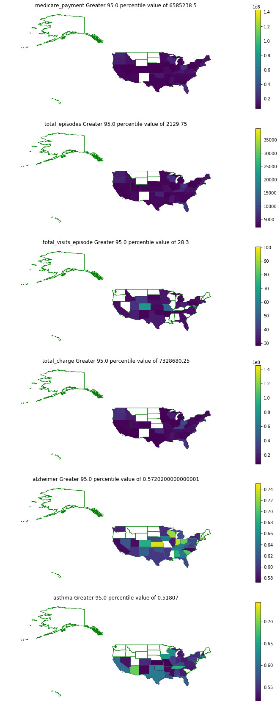

#### Correlation Plots
The plots below shows the correlation of each variable against each of the variables in the training set

```python
corr = medicare_data_train.corr()
mask = np.zeros_like(corr, dtype=np.bool)
mask[np.triu_indices_from(mask)] = True

f, ax = plt.subplots(figsize=(20, 20))
cmap = sns.diverging_palette(220, 10, as_cmap=True)
sns.heatmap(corr, mask=mask, cmap=cmap);
```

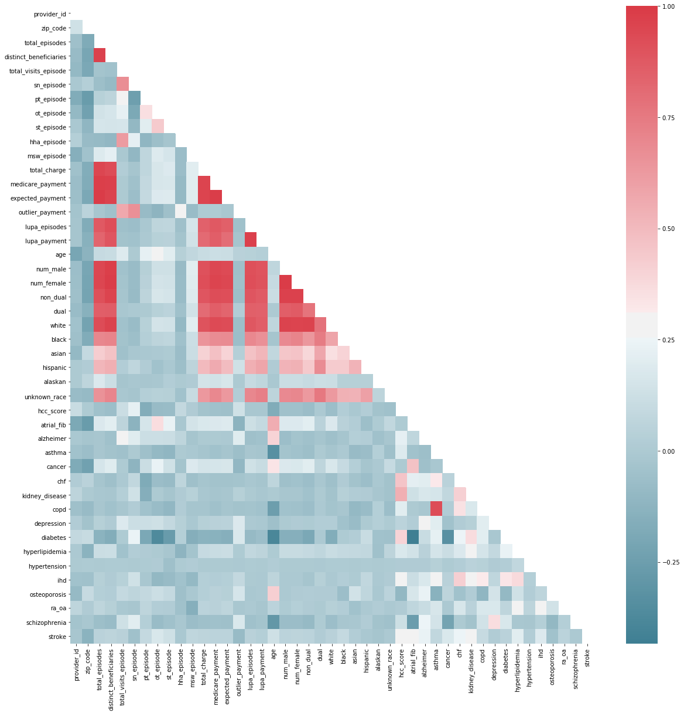


The strongest correlations exits between the following pairs of columns:
```python
def filterCorrelation(corr, corr_thres = 0.5):
    corr_filtered = corr.where(~np.tril(np.ones(corr.shape)).astype(np.bool))
    corr_filtered = corr_filtered.stack()
    corr_filtered.name = 'Corr Coefficient'
    corr_filtered.index.names = ['feat1', 'feat2']
    corr_filtered = corr_filtered[corr_filtered > corr_thres].to_frame()
    corr_filtered = corr_filtered.stack().reset_index()
    corr_filtered = corr_filtered.drop('level_2', axis=1)
    corr_filtered.columns = ['feat_1', 'feat_2', 'corr']
    corr_filtered = corr_filtered.sort_values(by=['corr', 'feat_1', 'feat_2'], ascending=False)
    return corr_filtered
```
```python
#View Correlated of  Columns over 0.6
filtered_corr = filterCorrelation(corr, corr_thres = 0.6)
filtered_corr.head()
```
<table class="dataframe">
  <thead>
    <tr style="text-align: right;">    
      <th>feat_1</th>
      <th>feat_2</th>
      <th>corr</th>
    </tr>
  </thead>
  <tbody>
    <tr>      
      <td>total_episodes</td>
      <td>expected_payment</td>  
      <td>0.991620</td>  
    </tr> 
   <tr>      
      <td>num_male</td>
      <td>num_female</td>  
      <td>0.990460</td>  
    </tr> 
   <tr>      
      <td>medicare_payment</td>
      <td>expected_payment</td>  
      <td>0.985884</td>  
    </tr> 
   <tr>      
      <td>distinct_beneficiaries</td>
      <td>num_female</td>  
      <td>0.984576</td>  
    </tr> 
   <tr>      
      <td>distinct_beneficiaries</td>
      <td>num_male</td>  
      <td>0.982362</td>  
    </tr> 
  </tbody>
</table>


#### Scatter Plots
The Scatter plots below shows the correlation of each variable against each of the variables in the training set

Plot 1:
We observe the following correlation:
<ul>
 <li>total_episodes and distinct_benefeciaries</li>
 <li>sn_episodes and total_visits_episodes</li>
 </ul>

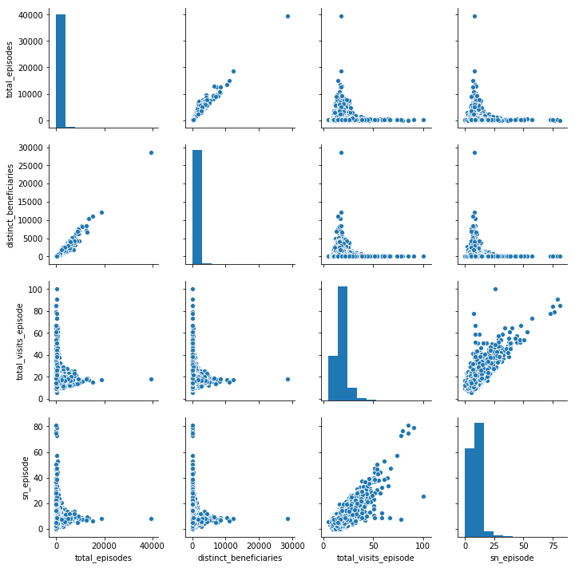

Plot 2: No correlation exits between the variables 

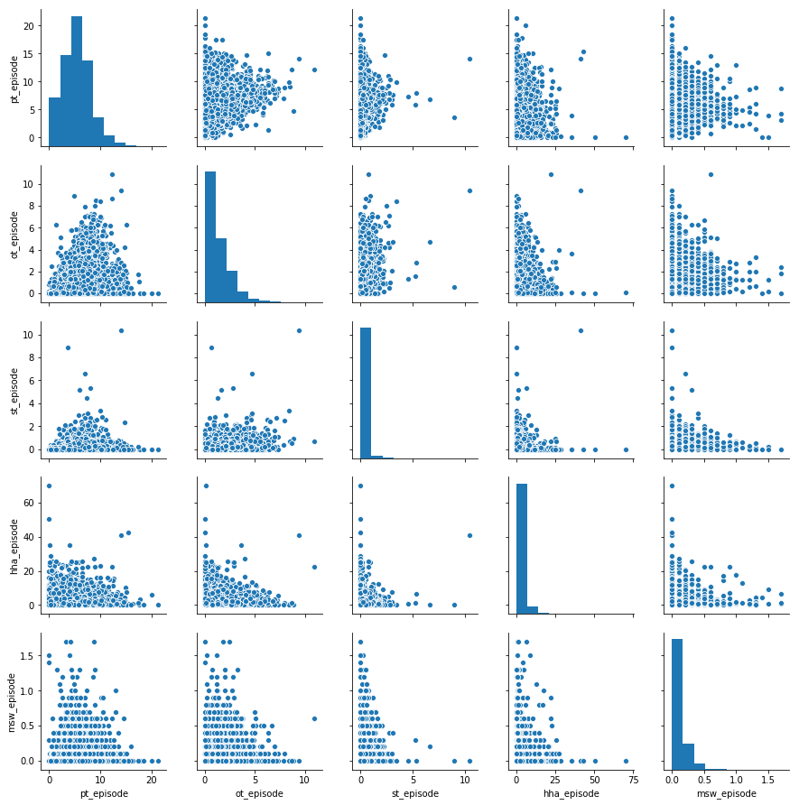

Plot 3:

We observe the following correlation:
<ul>
 <li>total_charge and medicare_payment</li>
 <li>total_charge and expected_payment</li>
 <li>lupa_episodes and expected_payment</li>
 <li>lupa_episodes and medicare_payment</li>
 <li>lupa_episodes and total_charge</li>
</ul>

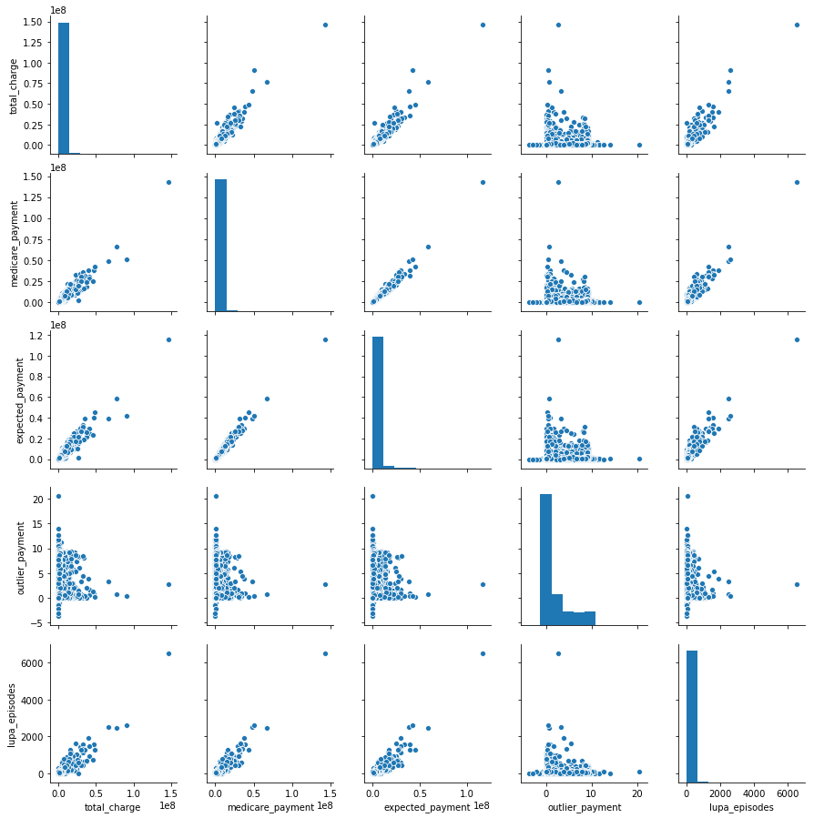

Plot 4:

We observe the following correlation:
<ul>
 <li>Correlation between Lupa payment and num_male</li>
 <li>Correlation between Lupa payment and num_female</li>
 <li>Correlation between Lupa payment and non_dual</li>
 <li>Correlation between  num_male and num_female</li>
 <li>num_male and num_dual</li>
 <li>num_female and num_dual</li>
 <li>non_dual and num_female</li>
 <li>non_dual and num_male</li>
 </ul>

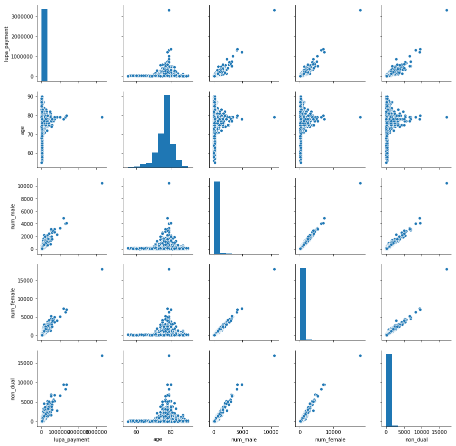

Plot 5: No correlation exits between the variables 

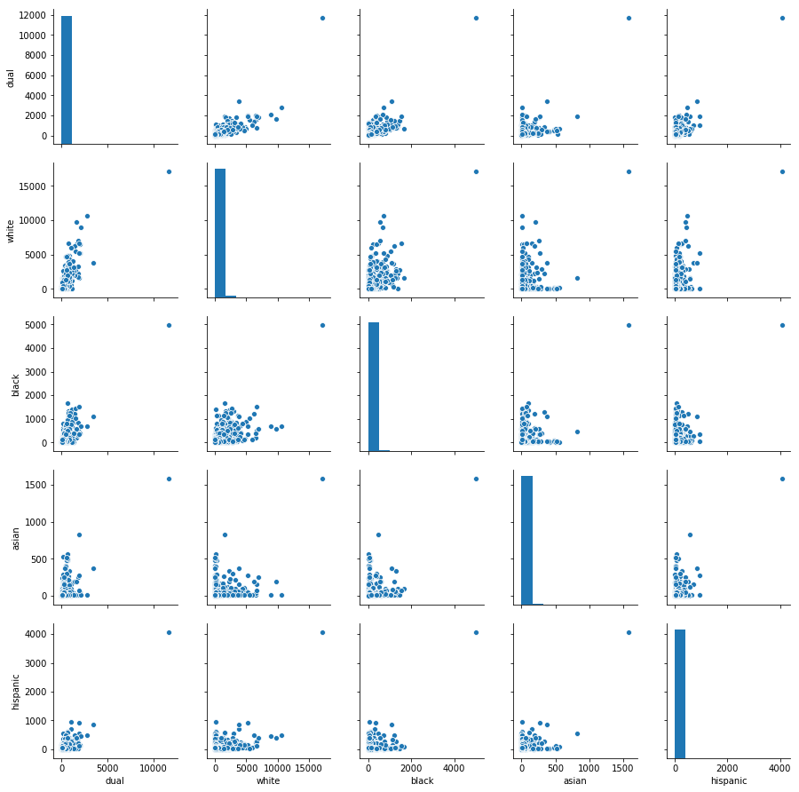

Plot 6: No correlation exits between the variables 

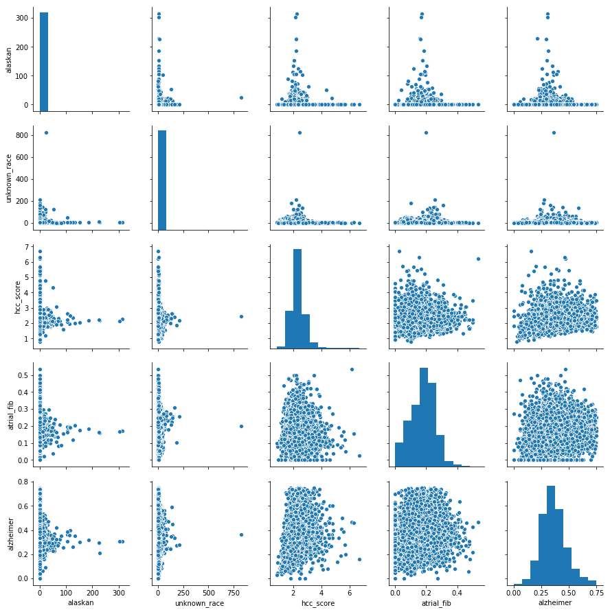

Plot 7: Some correlation exits betwen COPD and ASTHMA

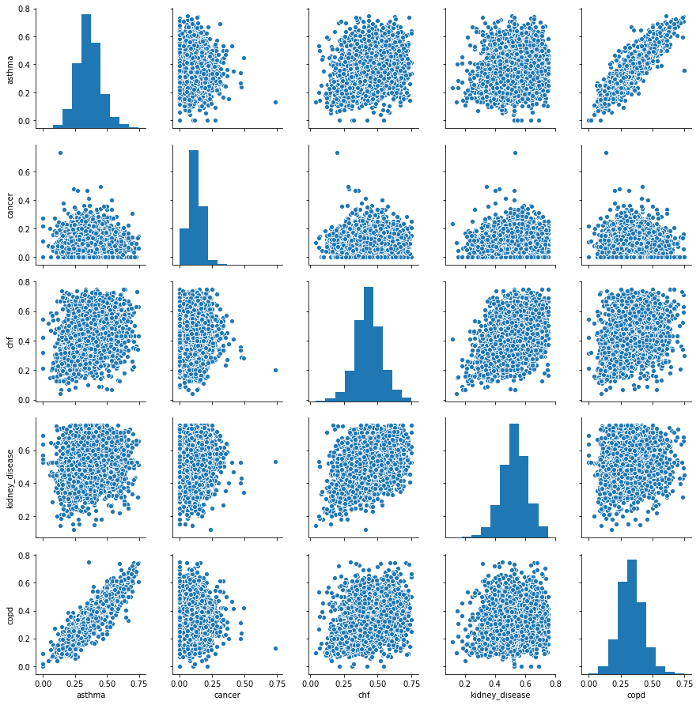

Plot 8: No correlation exits between the variables 

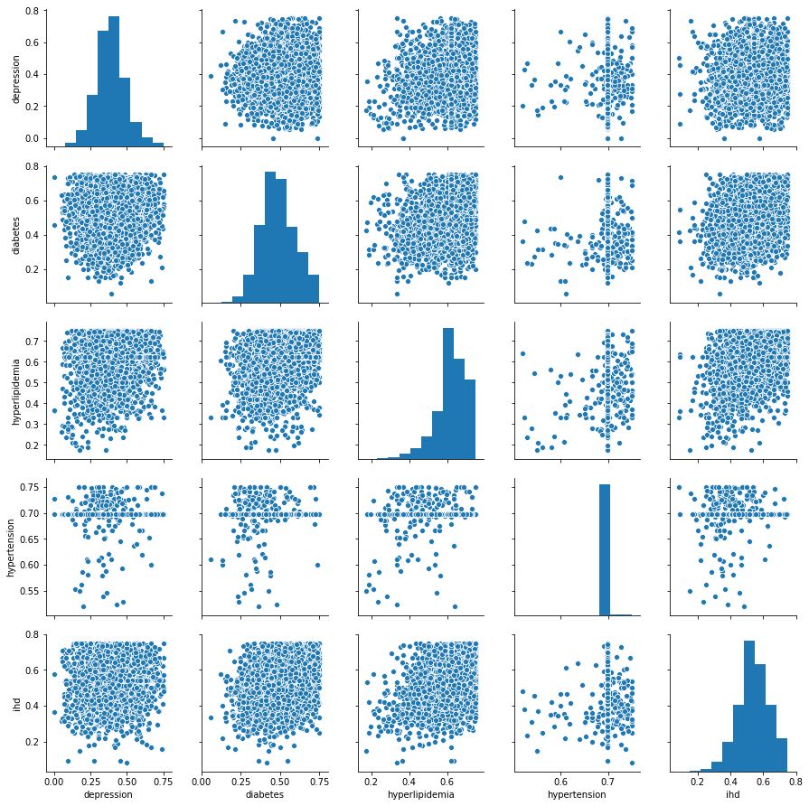

Plot 9: No correlation exits between the variables 

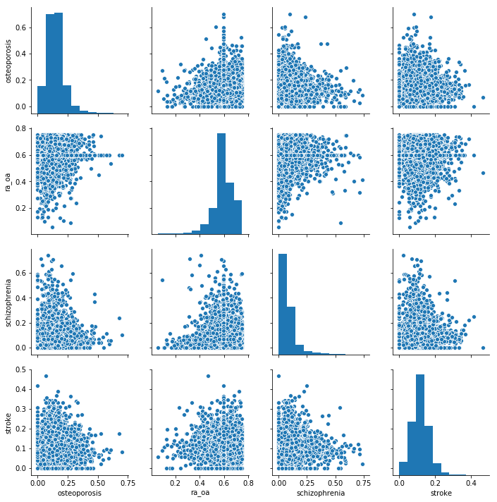

