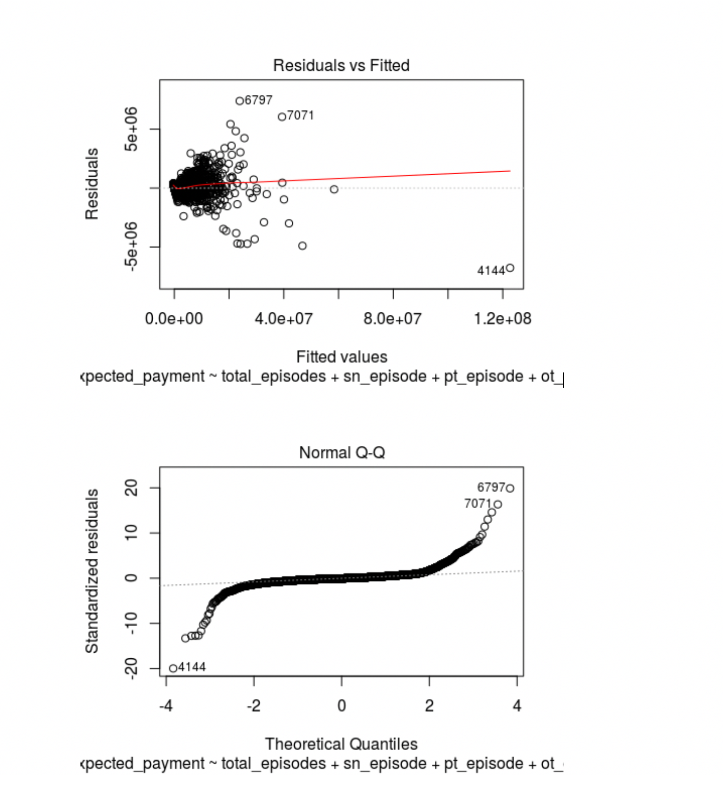

## STAT-109 Intro to Statistical Modeling - Final Project

#### Contributors : [Phillip Booth](mailto:phillip.booth2015@gmail.com), [Eliud Omollo](woordy2000@gmail.com) , [Jack Carter](jcarter2014@gmail.com), [Vivek Mishra](mailto:iblpvivek@icloud.com)

<HR>

### [Welcome](readme.md)&emsp;|&emsp;[Data Set](data-set.md)&emsp;|&emsp;[Introduction and EDA](eda.md)&emsp;|&emsp;[**_Model Building_**](model-building.md)&emsp;|&emsp;[Summary](summary.md)

<HR>

## Model Building


## Content:
- [Response Variable](#response-variable)
- [Load Train and Test Data](#load-train-and-test-data)

- [Initial fit and diagnostics](#initial-fit-and-diagnostics)

- [Adjustments and refitting](#adjustments-and-refitting)

- [Run Predictions with final model](#run-predictions-with-final-model)

- [Results](#results)

- [References](#references)

  <HR>

#### Response Variable:

The response variable that contains the value we will be predicting is <b>expected_payment</b>

<HR>

#### Load Train and Test Data

```R
# Step 1: Grab the data
train_data = read.csv('medicare_data_train.csv')

test_data = read.csv('medicare_data_test.csv')
names(test_data)

```


```
##  [1] "provider_id"            "agency"                
##  [3] "address"                "city"                  
##  [5] "state"                  "zip_code"              
##  [7] "total_episodes"         "distinct_beneficiaries"
##  [9] "total_visits_episode"   "sn_episode"            
## [11] "pt_episode"             "ot_episode"            
## [13] "st_episode"             "hha_episode"           
## [15] "msw_episode"            "total_charge"          
## [17] "medicare_payment"       "expected_payment"      
## [19] "outlier_payment"        "lupa_episodes"         
## [21] "lupa_payment"           "age"                   
## [23] "num_male"               "num_female"            
## [25] "non_dual"               "dual"                  
## [27] "white"                  "black"                 
## [29] "asian"                  "hispanic"              
## [31] "alaskan"                "unknown_race"          
## [33] "hcc_score"              "atrial_fib"            
## [35] "alzheimer"              "asthma"                
## [37] "cancer"                 "chf"                   
## [39] "kidney_disease"         "copd"                  
## [41] "depression"             "diabetes"              
## [43] "hyperlipidemia"         "hypertension"          
## [45] "ihd"                    "osteoporosis"          
## [47] "ra_oa"                  "schizophrenia"         
## [49] "stroke"

```

Now we are pulling out columns that are not needed for regression.

```R
# Step 2: Identify and pull out columns that shouldn't be used in the regression
unused_columns = names(train_data) %in% c('provider_id', 'agency', 
                                'address', 'city', 'state', 'zip_code','num_female',
                                       'medicare_payment',
                                       'num_male','lupa_episodes','white',
                                 'total_charge','medical_payment','outlier_payment','lupa_payment',
                                       'age','non_dual', 'dual', 'white','black','asian','alaskan','hispanic', 'unknown_race','total_visits_episode')

medicare_data = train_data[!unused_columns]


```

To start we removed any columns that were not directly relevant to our regression analysis.

- Provider_id
- Agency
- Address
- City
- State
- Zip Code
  

These columns were removed because they are just identifiers for the Home Health Agencies in the dataset.

- Medicare_payment
- Outlier_Payment
- Total_Charge

Our dependent variable is expected_payment which is just a fractional percentage of Medicare_payment, Outlier_payment, and Total_charge.

- Lupa_episodes
- Lupa payment

The next two columns were removed because they are not relevant for our dependent variable expected_payment. Our dependent variable expected_payment is referring to the total amount that Medicare paid out for non-LUPA claims.

- Age
- Num_Male
- Num_female
- Lupa_episodes
- White
- Black
- Asian
- Alaskan
- Hispanic

Any columns that were related to population identifiers were removed because they are not values used to calculate the Medicare reimbursement amount for a particular medical episode. They are used solely for reporting purposes.

```
names(medicare_data)
##  [1] "total_episodes"         "distinct_beneficiaries"
##  [3] "sn_episode"             "pt_episode"            
##  [5] "ot_episode"             "st_episode"            
##  [7] "hha_episode"            "msw_episode"           
##  [9] "expected_payment"       "hcc_score"             
## [11] "atrial_fib"             "alzheimer"             
## [13] "asthma"                 "cancer"                
## [15] "chf"                    "kidney_disease"        
## [17] "copd"                   "depression"            
## [19] "diabetes"               "hyperlipidemia"        
## [21] "hypertension"           "ihd"                   
## [23] "osteoporosis"           "ra_oa"                 
## [25] "schizophrenia"          "stroke"

```

We now have clean train and test data which will be used further for our model building and running predictions on that model.

#### Intial Fit and Diagnostics

```R
# Step 3: Make initial fit and check diagnostics
fit = lm(expected_payment~., data = medicare_data)

# Step 3a: Check vif to see if we can remove variables with high multicollinearity

vif(fit)

```

Output

```R
##         total_episodes distinct_beneficiaries             sn_episode 
##              18.309558              18.791711               1.313985 
##             pt_episode             ot_episode             st_episode 
##               1.330109               1.597916               1.317611 
##            hha_episode            msw_episode              hcc_score 
##               1.109256               1.156158               1.803396 
##             atrial_fib              alzheimer                 asthma 
##               1.985833               1.485864               7.626320 
##                 cancer                    chf         kidney_disease 
##               1.430879               1.774313               1.749194 
##                   copd             depression               diabetes 
##               7.630764               1.392051               2.195436 
##         hyperlipidemia           hypertension                    ihd 
##               1.423268               1.016462               1.598135 
##           osteoporosis                  ra_oa          schizophrenia 
##               1.237579               1.264564               1.425327 
##                 stroke 
##               1.317173

```


As we can see we have several high vif's here which means there is higher multi collinearity between the predictor variables. 

Steps to remove the higher vifs predictors one by one

1. Since there are only two variables that have vif's more than 10, and they(total_episodes, distinct_beneficiaries) are not significantly huge we are going to keep them as we know those predictors are very important.

We have now fixed the multi collinearity.


#### Adjustments and Refitting.

We can see that all the vifs are less than 10. We have fixed the multi collinearity.

```R
# We have fixed multicollinearity
summary(low_vif_fit)

```

```
## 
## Call:
## lm(formula = expected_payment ~ ., data = low_vif)
## 
## Residuals:
##      Min       1Q   Median       3Q      Max 
## -6993442  -110207   -13775    89170  7418334 
## 
## Coefficients:
##                          Estimate Std. Error t value Pr(>|t|)    
## (Intercept)            -406229.06  371153.38  -1.095  0.27377    
## total_episodes            3079.13      16.69 184.509  < 2e-16 ***
## distinct_beneficiaries      53.53      25.55   2.095  0.03617 *  
## sn_episode                8783.73    1084.35   8.100 6.28e-16 ***
## pt_episode               53293.11    1729.53  30.814  < 2e-16 ***
## ot_episode               72836.47    4260.64  17.095  < 2e-16 ***
## st_episode              153116.97   13153.77  11.641  < 2e-16 ***
## hha_episode              -3949.88    1352.24  -2.921  0.00350 ** 
## msw_episode              18763.57   31171.07   0.602  0.54722    
## hcc_score                28045.28   11675.80   2.402  0.01633 *  
## atrial_fib             -212315.29   74333.81  -2.856  0.00430 ** 
## alzheimer               217351.56   43928.17   4.948 7.65e-07 ***
## asthma                 -137349.99  120959.08  -1.136  0.25620    
## cancer                 -147501.88   95790.05  -1.540  0.12364    
## chf                     -51880.07   56834.34  -0.913  0.36136    
## kidney_disease           20329.35   63216.87   0.322  0.74778    
## copd                     86943.53  117982.77   0.737  0.46119    
## depression               71945.91   47355.68   1.519  0.12873    
## diabetes                -76569.84   55904.08  -1.370  0.17083    
## hyperlipidemia           80415.11   59466.60   1.352  0.17633    
## hypertension           -143164.07  532568.91  -0.269  0.78808    
## ihd                    -149466.75   54199.78  -2.758  0.00583 ** 
## osteoporosis            -74351.73   65986.27  -1.127  0.25987    
## ra_oa                    87002.69   57038.38   1.525  0.12721    
## schizophrenia            -1242.54   69372.27  -0.018  0.98571    
## stroke                 -147637.07   98544.81  -1.498  0.13413    
## ---
## Signif. codes:  0 '***' 0.001 '**' 0.01 '*' 0.05 '.' 0.1 ' ' 1
## 
## Residual standard error: 371000 on 8085 degrees of freedom
## Multiple R-squared:  0.9877, Adjusted R-squared:  0.9877 
## F-statistic: 2.595e+04 on 25 and 8085 DF,  p-value: < 2.2e-16

```


We can see that this model has a lot of variables that has high p values. We will have to eventually take care of it. but lets look at the normality and equal variance of error terms


Above residuals and fitted  graph suggests that we fit a line when we should have fit a curve.  Lets take a look qq plot to see how the residuals are looking.


So the qq plot shows some non normality towards the tail end of the graphs, please take a look at the points 7557 and 7071, 5998. Point 7557 seems to be a influential point as well.


Lets perform some more tests to check for contant variance.

```R
ncvTest(fit)
## Non-constant Variance Score Test 
## Variance formula: ~ fitted.values 
## Chisquare = 111113, Df = 1, p = < 2.22e-16

```

The null hypothesis of the ncvTest is that we don't have  constant variance,Since our p value is very low so we can reject the null hypothesis , p-value of ncv test suggests we have non-constant variance

Lets look at the normality of the error term distribution.

```R
ad.test(fit$residuals)
## 
##  Anderson-Darling normality test
## 
## data:  fit$residuals
## A = 655, p-value < 2.2e-16
```

Anderson-Darling test has a low p-value, which suggests our error terms are not normally distributed


### Remove high p value variables from the data and Refit

```R
high_p_value = names(low_vif) %in% c('schizophrenia','hypertension','kidney_disease','msw_episode','copd','chf','osteoporosis','asthma','ra_oa','stroke','hyperlipidemia','diabetes','cancer','alzheimer')

low_p_value = low_vif[!high_p_value]
low_p_value_fit = lm(expected_payment ~ ., data = low_p_value)
summary(low_p_value_fit)

```

**Model Summary**

```
## 
## Call:
## lm(formula = expected_payment ~ ., data = low_p_value)
## 
## Residuals:
##      Min       1Q   Median       3Q      Max 
## -6944040  -107701   -14892    90281  7417169 
## 
## Coefficients:
##                          Estimate Std. Error t value Pr(>|t|)    
## (Intercept)            -480330.42   33030.10 -14.542  < 2e-16 ***
## total_episodes            3088.10      16.38 188.507  < 2e-16 ***
## distinct_beneficiaries      39.50      24.89   1.587 0.112586    
## sn_episode                9708.30    1041.21   9.324  < 2e-16 ***
## pt_episode               54600.27    1676.08  32.576  < 2e-16 ***
## ot_episode               74549.03    4172.16  17.868  < 2e-16 ***
## st_episode              159339.95   12981.78  12.274  < 2e-16 ***
## hha_episode              -3949.95    1332.60  -2.964 0.003045 ** 
## hcc_score                25896.04    9375.67   2.762 0.005757 ** 
## atrial_fib             -216976.91   59079.55  -3.673 0.000242 ***
## depression              129330.26   41560.22   3.112 0.001865 ** 
## ihd                    -140114.46   46406.02  -3.019 0.002541 ** 
## ---
## Signif. codes:  0 '***' 0.001 '**' 0.01 '*' 0.05 '.' 0.1 ' ' 1
## 
## Residual standard error: 371600 on 8099 degrees of freedom
## Multiple R-squared:  0.9876, Adjusted R-squared:  0.9876 
## F-statistic: 5.88e+04 on 11 and 8099 DF,  p-value: < 2.2e-16

```

Now all the variables have very low p values and R squared values are high as well.


Lets look at the vif, ncvtest and ad test.

```R
vif(low_p_value_fit)
##         total_episodes distinct_beneficiaries             sn_episode 
##              17.588060              17.786779               1.207687 
##             pt_episode             ot_episode             st_episode 
##               1.245242               1.527421               1.279346 
##            hha_episode              hcc_score             atrial_fib 
##               1.073877               1.159190               1.250480 
##             depression                    ihd 
##               1.068807               1.167883

ncvTest(low_p_value_fit)
## Non-constant Variance Score Test 
## Variance formula: ~ fitted.values 
## Chisquare = 109795.1, Df = 1, p = < 2.22e-16
ad.test(low_p_value_fit$residuals)
## 
##  Anderson-Darling normality test
## 
## data:  low_p_value_fit$residuals
## A = 663.2, p-value < 2.2e-16


```

All the vif's are low, but there is still seems to non constant variance. AD test also suggests test that error terms are non normally distributed.


#### All Possible Regressions

Lets look at the all possible regressions method with low_p_value input data.

```R
all_fit = allpossregs(low_p_value_fit, best=3)
```

We want to find out the best 3 models. Lets look at the results.

```
all_fit
##            rssp       sigma2 adjRsq         Cp        AIC        BIC
## 1  1.508932e+15 1.860812e+11  0.983   2822.543  10933.543  10947.545
## 1  6.531405e+15 8.054514e+11  0.928  39201.473  47312.473  47326.475
## 1  8.711667e+16 1.074321e+13  0.036 622899.071 631010.071 631024.073
## 2  1.238445e+15 1.527436e+11  0.986    865.345   8976.345   8997.348
## 2  1.306961e+15 1.611941e+11  0.986   1361.623   9472.623   9493.626
## 2  1.393436e+15 1.718594e+11  0.985   1987.976  10098.976  10119.979
## 3  1.158907e+15 1.429514e+11  0.987    291.233   8402.233   8430.237
## 3  1.180789e+15 1.456506e+11  0.987    449.727   8560.727   8588.731
## 3  1.230938e+15 1.518364e+11  0.986    812.967   8923.967   8951.971
## 4  1.138708e+15 1.404772e+11  0.987    146.924   8257.924   8292.929
## 4  1.145259e+15 1.412853e+11  0.987    194.373   8305.373   8340.378
## 4  1.155563e+15 1.425565e+11  0.987    269.009   8380.009   8415.014
## 5  1.124946e+15 1.387965e+11  0.988     49.240   8160.240   8202.246
## 5  1.135709e+15 1.401244e+11  0.987    127.198   8238.198   8280.204
## 5  1.135798e+15 1.401355e+11  0.987    127.846   8238.846   8280.852
## 6  1.122604e+15 1.385247e+11  0.988     34.283   8145.283   8194.290
## 6  1.123728e+15 1.386634e+11  0.988     42.422   8153.422   8202.429
## 6  1.123862e+15 1.386799e+11  0.988     43.388   8154.388   8203.395
## 7  1.121477e+15 1.384027e+11  0.988     28.116   8139.116   8195.124
## 7  1.121625e+15 1.384209e+11  0.988     29.185   8140.185   8196.193
## 7  1.121978e+15 1.384645e+11  0.988     31.746   8142.746   8198.754
## 8  1.120449e+15 1.382929e+11  0.988     22.674   8133.674   8196.682
## 8  1.120721e+15 1.383265e+11  0.988     24.640   8135.640   8198.649
## 8  1.120872e+15 1.383450e+11  0.988     25.731   8136.731   8199.739
## 9  1.119547e+15 1.381986e+11  0.988     18.138   8129.138   8199.148
## 9  1.119736e+15 1.382219e+11  0.988     19.504   8130.504   8200.514
## 9  1.119772e+15 1.382264e+11  0.988     19.769   8130.769   8200.778
## 10 1.118495e+15 1.380858e+11  0.988     12.518   8123.518   8200.529
## 10 1.119201e+15 1.381729e+11  0.988     17.629   8128.629   8205.640
## 10 1.119361e+15 1.381927e+11  0.988     18.786   8129.786   8206.797
## 11 1.118148e+15 1.380599e+11  0.988     12.000   8123.000   8207.012

```

**We are going to select a model which has the lowest AIC/BIC combination.**


```R
# Select the model with 5 variables that has the lowest AIC/BIC
low_aic_bic_fit = lm(expected_payment ~ total_episodes + sn_episode + pt_episode + 		  ot_episode + st_episode + hcc_score, data = low_p_value)

summary(low_aic_bic_fit)

## 
## Call:
## lm(formula = expected_payment ~ total_episodes + sn_episode + 
##     pt_episode + ot_episode + st_episode + hcc_score, data = low_p_value)
## 
## Residuals:
##      Min       1Q   Median       3Q      Max 
## -6768391  -107617   -18344    91014  7387066 
## 
## Coefficients:
##                  Estimate Std. Error t value Pr(>|t|)    
## (Intercept)    -5.297e+05  2.502e+04 -21.174   <2e-16 ***
## total_episodes  3.112e+03  3.983e+00 781.170   <2e-16 ***
## sn_episode      9.480e+03  1.006e+03   9.428   <2e-16 ***
## pt_episode      5.510e+04  1.657e+03  33.249   <2e-16 ***
## ot_episode      7.281e+04  3.987e+03  18.262   <2e-16 ***
## st_episode      1.568e+05  1.290e+04  12.150   <2e-16 ***
## hcc_score       1.630e+04  9.031e+03   1.805   0.0711 .  
## ---
## Signif. codes:  0 '***' 0.001 '**' 0.01 '*' 0.05 '.' 0.1 ' ' 1
## 
## Residual standard error: 372500 on 8104 degrees of freedom
## Multiple R-squared:  0.9876, Adjusted R-squared:  0.9876 
## F-statistic: 1.072e+05 on 6 and 8104 DF,  p-value: < 2.2e-16


```

```R
plot(low_aic_bic_fit)
```



```R
ncvTest(low_aic_bic_fit)
## Non-constant Variance Score Test 
## Variance formula: ~ fitted.values 
## Chisquare = 106262.2, Df = 1, p = < 2.22e-16
ad.test(low_aic_bic_fit$residuals)
## 
##  Anderson-Darling normality test
## 
## data:  low_aic_bic_fit$residuals
## A = 664.9, p-value < 2.2e-16

```

**We still have non constant variance and non normality in error terms.**


#### Power Transformations

```R
# Perform a power transform to see if we can change the data to make normal errors with equal variance
first_power_transform = powerTransform(family="bcnPower", with(low_p_value, 
      cbind(total_episodes , sn_episode ,pt_episode ,ot_episode , st_episode ,hcc_score)))
summary(first_power_transform)

## bcnPower transformation to Multinormality 
## 
## Estimated power, lambda
##                Est Power Rounded Pwr Wald Lwr Bnd Wald Upr Bnd
## total_episodes    0.0168       0.017       0.0024       0.0312
## sn_episode       -1.6627      -1.663      -1.7366      -1.5888
## pt_episode        0.6492       0.649       0.6254       0.6731
## ot_episode        0.2489       0.249       0.2330       0.2648
## st_episode       -0.3733      -0.373      -0.3980      -0.3485
## hcc_score        -1.5670      -1.567      -1.7082      -1.4259
## 
## Estimated location, gamma
##                Est gamma Std Err. Wald Lower Bound Wald Upper Bound
## total_episodes    0.1000       NA               NA               NA
## sn_episode       15.9783       NA               NA               NA
## pt_episode        0.1000       NA               NA               NA
## ot_episode        0.1000       NA               NA               NA
## st_episode        0.1000       NA               NA               NA
## hcc_score         3.5938       NA               NA               NA
## 
## Likelihood ratio tests about transformation parameters
##                                       LRT df pval
## LR test, lambda = (0 0 0 0 0 0)  9030.417  6    0
## LR test, lambda = (1 1 1 1 1 1) 54126.423  6    0

```


Lets fit the model with the suggested transformations.

```R
power_transform_fit = lm(expected_payment ~ I(total_episodes^(0.017)) + I(sn_episode^(.1)) + I(pt_episode^(0.649)) + I(ot_episode^(0.2489))+ I(st_episode^(0.1)) + I(hcc_score^(0.1))
                         , data = medicare_data)
summary(power_transform_fit)
## 
## Call:
## lm(formula = expected_payment ~ I(total_episodes^(0.017)) + I(sn_episode^(0.1)) + 
##     I(pt_episode^(0.649)) + I(ot_episode^(0.2489)) + I(st_episode^(0.1)) + 
##     I(hcc_score^(0.1)), data = medicare_data)
## 
## Residuals:
##       Min        1Q    Median        3Q       Max 
##  -2061342  -1168975   -624734    495140 104567019 
## 
## Coefficients:
##                             Estimate Std. Error t value Pr(>|t|)    
## (Intercept)               -107003547    2076284 -51.536  < 2e-16 ***
## I(total_episodes^(0.017))   98221991    1308475  75.066  < 2e-16 ***
## I(sn_episode^(0.1))         -1570482     520548  -3.017 0.002561 ** 
## I(pt_episode^(0.649))         112963      30048   3.759 0.000172 ***
## I(ot_episode^(0.2489))        116361      81492   1.428 0.153363    
## I(st_episode^(0.1))           -48044      78792  -0.610 0.542042    
## I(hcc_score^(0.1))           2089542    1320202   1.583 0.113519    
## ---
## Signif. codes:  0 '***' 0.001 '**' 0.01 '*' 0.05 '.' 0.1 ' ' 1
## 
## Residual standard error: 2441000 on 8104 degrees of freedom
## Multiple R-squared:  0.4657, Adjusted R-squared:  0.4653 
## F-statistic:  1177 on 6 and 8104 DF,  p-value: < 2.2e-16

```

Lets plot the residuals and error terms and run the normality tests

```R
plot(power_transform_fit)
```


####Further Transformations

Our previous graphs are still showing some sort of pattern which it should not. so Lets to log the expected amount(y) and see how do they look.

```R
# Log the y variable to fix non constant variance
power_transform_fit_log = lm(log(expected_payment) ~ I(total_episodes^(0.017)) + I(sn_episode^(.1)) + I(pt_episode^(0.649)) + I(ot_episode^(0.2489))+ I(st_episode^(0.1)) + I(hcc_score^(0.1))
                         , data = medicare_data)
summary(power_transform_fit_log)

## 
## Call:
## lm(formula = log(expected_payment) ~ I(total_episodes^(0.017)) + 
##     I(sn_episode^(0.1)) + I(pt_episode^(0.649)) + I(ot_episode^(0.2489)) + 
##     I(st_episode^(0.1)) + I(hcc_score^(0.1)), data = medicare_data)
## 
## Residuals:
##      Min       1Q   Median       3Q      Max 
## -0.28981 -0.03846 -0.00357  0.03518  0.50139 
## 
## Coefficients:
##                             Estimate Std. Error  t value Pr(>|t|)    
## (Intercept)               -4.653e+01  5.171e-02 -899.837  < 2e-16 ***
## I(total_episodes^(0.017))  5.361e+01  3.259e-02 1645.063  < 2e-16 ***
## I(sn_episode^(0.1))        4.027e-01  1.296e-02   31.063  < 2e-16 ***
## I(pt_episode^(0.649))      1.559e-01  7.483e-04  208.306  < 2e-16 ***
## I(ot_episode^(0.2489))     9.360e-02  2.030e-03   46.120  < 2e-16 ***
## I(st_episode^(0.1))        1.838e-02  1.962e-03    9.367  < 2e-16 ***
## I(hcc_score^(0.1))         1.062e-01  3.288e-02    3.229  0.00125 ** 
## ---
## Signif. codes:  0 '***' 0.001 '**' 0.01 '*' 0.05 '.' 0.1 ' ' 1
## 
## Residual standard error: 0.0608 on 8104 degrees of freedom
## Multiple R-squared:  0.9977, Adjusted R-squared:  0.9977 
## F-statistic: 5.945e+05 on 6 and 8104 DF,  p-value: < 2.2e-16

```


```R
plot(power_transform_fit_log)
```


This curve is much better, qqplot looks much better.but residuals plot can be better. **Curve of the residuals suggests that we fit a line when we should fit a curve.**

We are now going to try polynomial degree on the predictor variable to see it can improve our model. 

```R
power_transform_fit_log_poly_1 =
lm(log(expected_payment) ~ I(total_episodes^(0.017)) + poly(total_episodes, 2) +poly(sn_episode,2)+ poly(pt_episode,2) + I(sn_episode^(.1)) + I(pt_episode^(0.649)) + I(ot_episode^(0.2489))+ I(st_episode^(0.1)) + I(hcc_score^(0.1))
                         , data = medicare_data)
summary(power_transform_fit_log_poly_1)
## 
## Call:
## lm(formula = log(expected_payment) ~ I(total_episodes^(0.017)) + 
##     poly(total_episodes, 2) + poly(sn_episode, 2) + poly(pt_episode, 
##     2) + I(sn_episode^(0.1)) + I(pt_episode^(0.649)) + I(ot_episode^(0.2489)) + 
##     I(st_episode^(0.1)) + I(hcc_score^(0.1)), data = medicare_data)
## 
## Residuals:
##      Min       1Q   Median       3Q      Max 
## -0.25925 -0.03581 -0.00284  0.03260  0.40222 
## 
## Coefficients:
##                             Estimate Std. Error  t value Pr(>|t|)    
## (Intercept)               -46.371315   0.068335 -678.590   <2e-16 ***
## I(total_episodes^(0.017))  54.415563   0.044832 1213.771   <2e-16 ***
## poly(total_episodes, 2)1   -1.804412   0.081732  -22.077   <2e-16 ***
## poly(total_episodes, 2)2    0.597887   0.064779    9.230   <2e-16 ***
## poly(sn_episode, 2)1        2.480734   0.108219   22.923   <2e-16 ***
## poly(sn_episode, 2)2       -1.352957   0.068049  -19.882   <2e-16 ***
## poly(pt_episode, 2)1       14.160030   0.797982   17.745   <2e-16 ***
## poly(pt_episode, 2)2       -1.320974   0.129277  -10.218   <2e-16 ***
## I(sn_episode^(0.1))        -0.048837   0.022904   -2.132   0.0330 *  
## I(pt_episode^(0.649))       0.002217   0.008665    0.256   0.7981    
## I(ot_episode^(0.2489))      0.103356   0.001919   53.871   <2e-16 ***
## I(st_episode^(0.1))         0.022200   0.001823   12.179   <2e-16 ***
## I(hcc_score^(0.1))          0.052076   0.030389    1.714   0.0866 .  
## ---
## Signif. codes:  0 '***' 0.001 '**' 0.01 '*' 0.05 '.' 0.1 ' ' 1
## 
## Residual standard error: 0.05589 on 8098 degrees of freedom
## Multiple R-squared:  0.9981, Adjusted R-squared:  0.9981 
## F-statistic: 3.52e+05 on 12 and 8098 DF,  p-value: < 2.2e-16

plot(power_transform_fit_log_poly_1)

```


Above graph looks much better, both the qqplot and residual plot looks good.

lets take a look at the ncvtest and ad tests.

```R
ncvTest(power_transform_fit_log_poly_1)
## Non-constant Variance Score Test 
## Variance formula: ~ fitted.values 
## Chisquare = 31.37867, Df = 1, p = 2.123e-08

```

ncv test still shows that there is some non constant variance, but if you look at the initial chisqare value and current one, we have significantly improved the model.

### Run Predictions with final model

We will use predict method to test the train model with the test_data.

```R
test_predictions = predict(object = power_transform_fit_log_poly_1, newdata= test_data, interval = 'prediction')
```

### Results

Now we calculate the R-squared value using the predicted values and exact values.

```R
r_squared <- function(vals, preds) {   1 - (sum((vals - preds)^2) / sum((vals - mean(preds))^2)) }
r_squared(vals = log(test_data$expected_payment), preds = test_predictions[,1])


```

```
## [1] 0.9981883
```

R sqaured value is almost .99 which is really good and pretty much matches with our train data r squared value.

### References

