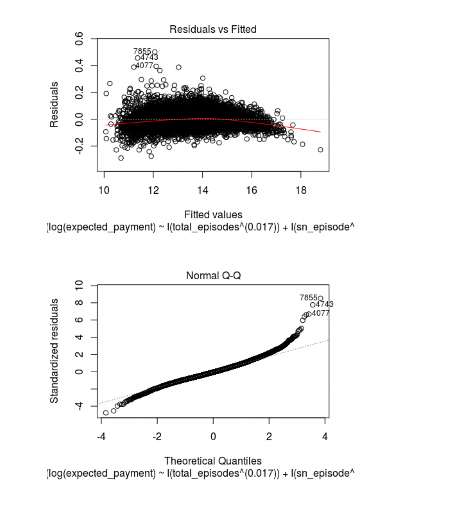

## STAT-109 Intro to Statistical Modeling - Final Project

#### Contributors : [Phillip Booth](mailto:phillip.booth2015@gmail.com), [Eliud Omollo](woordy2000@gmail.com) , [Jack Carter](jcarter2014@gmail.com), [Vivek Mishra](mailto:iblpvivek@icloud.com)

<HR>

### [Welcome](readme.md)&emsp;|&emsp;[Data Set](data-set.md)&emsp;|&emsp;[Introduction and EDA](eda.md)&emsp;|&emsp;[**_Model Building_**](model-building.md)&emsp;|&emsp;[Summary](#summary)

<HR>
##Model Building


## Content:
- [Load Train and Test Data](#load-train-and-test-data)

- [Initial fit and diagnostics](#initial-fit-and-diagnostics)

- [Adjustments and refitting](#adjustments-and-refitting)

- [Run Predictions with final model](#run-predictions-with-final-model)

- [Results](#results)

- [References](#references)

  

<HR>

#### Load Train and Test Data

```R
# Step 1: Grab the data
train_data = read.csv('medicare_data_train.csv')

test_data = read.csv('medicare_data_test.csv')
names(test_data)

```


```
##  [1] "provider_id"            "agency"                
##  [3] "address"                "city"                  
##  [5] "state"                  "zip_code"              
##  [7] "total_episodes"         "distinct_beneficiaries"
##  [9] "total_visits_episode"   "sn_episode"            
## [11] "pt_episode"             "ot_episode"            
## [13] "st_episode"             "hha_episode"           
## [15] "msw_episode"            "total_charge"          
## [17] "medicare_payment"       "expected_payment"      
## [19] "outlier_payment"        "lupa_episodes"         
## [21] "lupa_payment"           "age"                   
## [23] "num_male"               "num_female"            
## [25] "non_dual"               "dual"                  
## [27] "white"                  "black"                 
## [29] "asian"                  "hispanic"              
## [31] "alaskan"                "unknown_race"          
## [33] "hcc_score"              "atrial_fib"            
## [35] "alzheimer"              "asthma"                
## [37] "cancer"                 "chf"                   
## [39] "kidney_disease"         "copd"                  
## [41] "depression"             "diabetes"              
## [43] "hyperlipidemia"         "hypertension"          
## [45] "ihd"                    "osteoporosis"          
## [47] "ra_oa"                  "schizophrenia"         
## [49] "stroke"

```

Now we are pulling out columns that are not needed for regression.

```R
# Step 2: Identify and pull out columns that shouldn't be used in the regression
unused_columns = names(train_data) %in% c('provider_id', 'agency', 
                                'address', 'city', 'state', 'zip_code')
medicare_data = train_data[!unused_columns]


```

We now have clean train and test data which will be used further for our model building and running predictions on that model.

#### Intial Fit and Diagnostics

```R
# Step 3: Make initial fit and check diagnostics
fit = lm(expected_payment~., data = medicare_data)

# Step 3a: Check vif to see if we can remove variables with high multicollinearity
vif(fit)

```

Output

```R
##         total_episodes distinct_beneficiaries   total_visits_episode 
##              69.204198             119.934696            1055.608984 
##             sn_episode             pt_episode             ot_episode 
##             540.567025             215.898571              43.952784 
##             st_episode            hha_episode            msw_episode 
##               4.945398             296.025884               1.750799 
##           total_charge       medicare_payment        outlier_payment 
##              14.164621              66.626540               2.182635 
##          lupa_episodes           lupa_payment                    age 
##              39.993137              38.284335               3.299836 
##               num_male             num_female               non_dual 
##              75.828270              91.480780              30.306595 
##                   dual                  white                  black 
##              10.067188              37.943090               4.123740 
##                  asian               hispanic                alaskan 
##               2.128161               2.861538               1.134430 
##           unknown_race              hcc_score             atrial_fib 
##               2.988749               1.952741               2.366717 
##              alzheimer                 asthma                 cancer 
##               2.051919               7.880206               1.489557 
##                    chf         kidney_disease                   copd 
##               1.853257               1.769271               7.706468 
##             depression               diabetes         hyperlipidemia 
##               1.501513               2.326293               1.451529 
##           hypertension                    ihd           osteoporosis 
##               1.018977               1.642341               1.430793 
##                  ra_oa          schizophrenia                 stroke 
##               1.298048               1.534871               1.332558

```


As we can see we have several high vif's here which means there is higher multi collinearity between the predictor variables. 

Steps to remove the higher vifs predictors one by one

1. remove the variable with highest vif's 
2. run the vif test again 
3. repeat the steps 1,2 untill all the predictor's have vif's less than 10.

We have now fixed the multi collinearity.

Let's filter the data and take only one's which has low vif's

```R
high_vif = names(medicare_data) %in% c('total_visits_episode',
                                       'distinct_beneficiaries','num_female',
                                       'medicare_payment',
                                       'num_male','lupa_episodes','white',
                                       'total_episodes')
low_vif = medicare_data[!high_vif]

```


#### Adjustments and Refitting.

Let's refit the model with the data (low_vif) that we have filtered from the previous steps.

```R
low_vif_fit = lm(expected_payment ~ ., data = low_vif)
vif(low_vif_fit)

```

Output below

```

##      sn_episode      pt_episode      ot_episode      st_episode 
##        2.057840        1.369806        1.618578        1.333832 
##     hha_episode     msw_episode    total_charge outlier_payment 
##        1.205294        1.160690        6.385446        2.101625 
##    lupa_payment             age        non_dual            dual 
##        7.019267        3.212598        8.376549        7.316824 
##           black           asian        hispanic         alaskan 
##        2.457316        1.778710        2.299510        1.059890 
##    unknown_race       hcc_score      atrial_fib       alzheimer 
##        2.708800        1.934250        2.269646        2.015172 
##          asthma          cancer             chf  kidney_disease 
##        7.865956        1.470133        1.835192        1.758304 
##            copd      depression        diabetes  hyperlipidemia 
##        7.683018        1.488211        2.319540        1.437418 
##    hypertension             ihd    osteoporosis           ra_oa 
##        1.017615        1.622765        1.418843        1.267682 
##   schizophrenia          stroke 
##        1.530372        1.328366

```


We can see that all the vifs are less than 10. We have fixed the multi collinearity.

```R
# We have fixed multicollinearity
summary(low_vif_fit)

```

```
## 
## Call:
## lm(formula = expected_payment ~ ., data = low_vif)
## 
## Residuals:
##       Min        1Q    Median        3Q       Max 
## -17386442   -323035     44777    320566   7652197 
## 
## Coefficients:
##                   Estimate Std. Error t value Pr(>|t|)    
## (Intercept)     -1.480e+06  7.533e+05  -1.964 0.049527 *  
## sn_episode      -2.354e+04  2.630e+03  -8.951  < 2e-16 ***
## pt_episode       7.956e+03  3.402e+03   2.339 0.019371 *  
## ot_episode       3.216e+04  8.311e+03   3.870 0.000110 ***
## st_episode       9.550e+04  2.565e+04   3.723 0.000198 ***
## hha_episode     -1.756e+04  2.732e+03  -6.429 1.36e-10 ***
## msw_episode      4.843e+04  6.053e+04   0.800 0.423685    
## total_charge     4.741e-01  5.020e-03  94.440  < 2e-16 ***
## outlier_payment  2.745e+04  4.128e+03   6.650 3.13e-11 ***
## lupa_payment    -1.010e+01  3.295e-01 -30.670  < 2e-16 ***
## age              7.695e+03  3.245e+03   2.371 0.017748 *  
## non_dual         2.503e+03  4.495e+01  55.698  < 2e-16 ***
## dual             3.522e+03  1.066e+02  33.042  < 2e-16 ***
## black            1.343e+03  1.103e+02  12.171  < 2e-16 ***
## asian           -1.975e+03  3.317e+02  -5.954 2.72e-09 ***
## hispanic         7.717e+01  1.809e+02   0.427 0.669599    
## alaskan          1.087e+04  9.493e+02  11.455  < 2e-16 ***
## unknown_race    -3.110e+03  1.075e+03  -2.894 0.003817 ** 
## hcc_score       -2.189e+04  2.344e+04  -0.934 0.350232    
## atrial_fib      -9.111e+04  1.540e+05  -0.591 0.554203    
## alzheimer        2.163e+05  9.915e+04   2.182 0.029173 *  
## asthma          -1.190e+05  2.381e+05  -0.500 0.617275    
## cancer          -5.557e+05  1.882e+05  -2.953 0.003157 ** 
## chf             -1.144e+03  1.120e+05  -0.010 0.991856    
## kidney_disease  -2.430e+04  1.228e+05  -0.198 0.843229    
## copd             2.956e+05  2.295e+05   1.288 0.197734    
## depression       2.376e+05  9.490e+04   2.504 0.012295 *  
## diabetes        -1.349e+05  1.114e+05  -1.211 0.225884    
## hyperlipidemia   5.525e+05  1.158e+05   4.770 1.88e-06 ***
## hypertension     2.960e+05  1.033e+06   0.287 0.774417    
## ihd              2.505e+05  1.059e+05   2.366 0.017989 *  
## osteoporosis     7.553e+02  1.369e+05   0.006 0.995600    
## ra_oa            6.514e+05  1.107e+05   5.885 4.15e-09 ***
## schizophrenia    8.145e+04  1.393e+05   0.585 0.558843    
## stroke          -4.473e+05  1.918e+05  -2.332 0.019727 *  
## ---
## Signif. codes:  0 '***' 0.001 '**' 0.01 '*' 0.05 '.' 0.1 ' ' 1
## 
## Residual standard error: 719000 on 8076 degrees of freedom
## Multiple R-squared:  0.9538, Adjusted R-squared:  0.9536 
## F-statistic:  4906 on 34 and 8076 DF,  p-value: < 2.2e-16

```


We can see that this model has a lot of variables that has high p values. We will have to eventually take care of it. but lets look at the normality and equal variance of error terms


Above residuals and fitted  graph suggests that we fit a line when we should have fit a curve.  Lets take a look qq plot to see how the residuals are looking.


So the qq plot shows some non normality towards the tail end of the graphs, please take a look at the points 7557 and 7071, 5998. Point 7557 seems to be a influential point as well.


Lets perform some more tests to check for contant variance.

```R
ncvTest(fit)
## Non-constant Variance Score Test 
## Variance formula: ~ fitted.values 
## Chisquare = 29804.32, Df = 1, p = < 2.22e-16
```

The null hypothesis of the ncvTest is that we don't have  constant variance,Since our p value is very low so we can reject the null hypothesis , p-value of ncv test suggests we have non-constant variance

Lets look at the normality of the error term distribution.

```R
ad.test(fit$residuals)
## 
## Anderson-Darling normality test
## 
## data:  fit$residuals
## A = 266.88, p-value < 2.2e-16

```

Anderson-Darling test has a low p-value, which suggests our error terms are not normally distributed


### Remove high p value variables from the data and Refit

```R
high_p_value = names(low_vif) %in% c('msw_episode',
                                     'kidney_disease',
                                     'osteoporosis',
                                     'atrial_fib',
                                     'hypertension',
                                     'asthma',
                                     'diabetes',
                                     'chf',
                                     'schizophrenia',
                                     'hispanic',
                                     'hcc_score',
                                     'copd',
                                     'alzheimer',
                                     'stroke',
                                     'ihd',
                                     'unknown_race',
                                     'pt_episode')

low_p_value = low_vif[!high_p_value]
low_p_value_fit = lm(expected_payment ~ ., data = low_p_value)
summary(low_p_value_fit)

```

**Model Summary**

```
## 
## Call:
## lm(formula = expected_payment ~ ., data = low_p_value)
## 
## Residuals:
##       Min        1Q    Median        3Q       Max 
## -17003139   -324756     38151    320478   7748508 
## 
## Coefficients:
##                   Estimate Std. Error t value Pr(>|t|)    
## (Intercept)     -1.439e+06  1.697e+05  -8.478  < 2e-16 ***
## sn_episode      -2.427e+04  2.492e+03  -9.740  < 2e-16 ***
## ot_episode       3.405e+04  7.850e+03   4.338 1.45e-05 ***
## st_episode       9.337e+04  2.527e+04   3.695 0.000221 ***
## hha_episode     -1.876e+04  2.672e+03  -7.020 2.39e-12 ***
## total_charge     4.761e-01  4.973e-03  95.746  < 2e-16 ***
## outlier_payment  2.863e+04  4.001e+03   7.154 9.15e-13 ***
## lupa_payment    -1.034e+01  3.171e-01 -32.601  < 2e-16 ***
## age              1.053e+04  2.056e+03   5.122 3.09e-07 ***
## non_dual         2.492e+03  4.318e+01  57.705  < 2e-16 ***
## dual             3.465e+03  9.464e+01  36.611  < 2e-16 ***
## black            1.342e+03  1.082e+02  12.399  < 2e-16 ***
## asian           -2.143e+03  3.208e+02  -6.679 2.56e-11 ***
## alaskan          1.081e+04  9.458e+02  11.426  < 2e-16 ***
## cancer          -6.493e+05  1.723e+05  -3.768 0.000166 ***
## depression       3.790e+05  8.323e+04   4.554 5.34e-06 ***
## hyperlipidemia   5.359e+05  1.045e+05   5.129 2.98e-07 ***
## ra_oa            7.307e+05  1.064e+05   6.870 6.89e-12 ***
## ---
## Signif. codes:  0 '***' 0.001 '**' 0.01 '*' 0.05 '.' 0.1 ' ' 1
## 
## Residual standard error: 720100 on 8093 degrees of freedom
## Multiple R-squared:  0.9536, Adjusted R-squared:  0.9535 
## F-statistic:  9781 on 17 and 8093 DF,  p-value: < 2.2e-16

```

Now all the variables have very low p values and R squared values are high as well.


Lets look at the vif, ncvtest and ad test.

```R
vif(low_p_value_fit)
##      sn_episode      ot_episode      st_episode     hha_episode 
##        1.842101        1.439702        1.290559        1.149484 
##    total_charge outlier_payment    lupa_payment             age 
##        6.248530        1.969062        6.483202        1.286464 
##        non_dual            dual           black           asian 
##        7.709750        5.753005        2.356962        1.659548 
##         alaskan          cancer      depression  hyperlipidemia 
##        1.049139        1.229068        1.141252        1.166452 
##           ra_oa 
##        1.167153
ncvTest(low_p_value_fit)
## Non-constant Variance Score Test 
## Variance formula: ~ fitted.values 
## Chisquare = 50785.29, Df = 1, p = < 2.22e-16
ad.test(low_p_value_fit$residuals)
## 
##  Anderson-Darling normality test
## 
## data:  low_p_value_fit$residuals
## A = 222.76, p-value < 2.2e-16

```

All the vif's are low, but there is still seems to non constant variance. AD test also suggests test that error terms are non normally distributed.


#### All Possible Regressions

Lets look at the all possible regressions method with low_p_value input data.

```R
all_fit = allpossregs(low_p_value_fit, best=3)
```

We want to find out the best 3 models. Lets look at the results.

```
all_fit
##            rssp       sigma2 adjRsq        Cp       AIC       BIC
## 1  7.578908e+15 9.346292e+11  0.916  6509.986 14620.986 14634.988
## 1  1.447249e+16 1.784744e+12  0.840 19805.217 27916.217 27930.219
## 1  2.808664e+16 3.463638e+12  0.689 46062.013 54173.013 54187.015
## 2  5.825183e+15 7.184488e+11  0.936  3129.681 11240.681 11261.684
## 2  6.703455e+15 8.267705e+11  0.926  4823.552 12934.552 12955.555
## 2  7.000416e+15 8.633961e+11  0.923  5396.282 13507.282 13528.285
## 3  5.373638e+15 6.628392e+11  0.941  2260.812 10371.812 10399.816
## 3  5.534926e+15 6.827342e+11  0.939  2571.880 10682.880 10710.884
## 3  5.667985e+15 6.991470e+11  0.937  2828.503 10939.503 10967.506
## 4  4.564267e+15 5.630726e+11  0.949   701.827  8812.827  8847.832
## 4  5.236701e+15 6.460277e+11  0.942  1998.710 10109.710 10144.715
## 4  5.261150e+15 6.490439e+11  0.942  2045.864 10156.864 10191.869
## 5  4.497294e+15 5.548790e+11  0.950   574.662  8685.662  8727.667
## 5  4.500284e+15 5.552479e+11  0.950   580.428  8691.428  8733.434
## 5  4.511664e+15 5.566520e+11  0.950   602.376  8713.376  8755.382
## 6  4.433809e+15 5.471136e+11  0.951   454.221  8565.221  8614.228
## 6  4.436997e+15 5.475070e+11  0.951   460.370  8571.370  8620.377
## 6  4.447474e+15 5.487998e+11  0.951   480.576  8591.576  8640.582
## 7  4.373591e+15 5.397496e+11  0.952   340.083  8451.083  8507.091
## 7  4.392005e+15 5.420221e+11  0.951   375.597  8486.597  8542.605
## 7  4.398018e+15 5.427641e+11  0.951   387.193  8498.193  8554.201
## 8  4.331336e+15 5.346009e+11  0.952   260.588  8371.588  8434.597
## 8  4.340242e+15 5.357001e+11  0.952   277.765  8388.765  8451.774
## 8  4.346474e+15 5.364692e+11  0.952   289.783  8400.783  8463.792
## 9  4.309308e+15 5.319477e+11  0.952   220.104  8331.104  8401.114
## 9  4.309384e+15 5.319571e+11  0.952   220.251  8331.251  8401.260
## 9  4.313803e+15 5.325025e+11  0.952   228.773  8339.773  8409.783
## 10 4.287354e+15 5.293029e+11  0.953   179.762  8290.762  8367.773
## 10 4.290465e+15 5.296871e+11  0.952   185.763  8296.763  8373.774
## 10 4.292646e+15 5.299562e+11  0.952   189.968  8300.968  8377.979
## 11 4.262435e+15 5.262916e+11  0.953   133.703  8244.703  8328.715
## 11 4.270883e+15 5.273346e+11  0.953   149.995  8260.995  8345.007
## 11 4.270985e+15 5.273472e+11  0.953   150.192  8261.192  8345.204
## 12 4.242307e+15 5.238709e+11  0.953    96.882  8207.882  8298.895
## 12 4.248512e+15 5.246373e+11  0.953   108.851  8219.851  8310.864
## 12 4.250955e+15 5.249388e+11  0.953   113.561  8224.561  8315.574
## 13 4.230885e+15 5.225250e+11  0.953    76.853  8187.853  8285.867
## 13 4.231704e+15 5.226262e+11  0.953    78.434  8189.434  8287.448
## 13 4.234032e+15 5.229137e+11  0.953    82.923  8193.923  8291.937
## 14 4.221243e+15 5.213986e+11  0.953    60.258  8171.258  8276.273
## 14 4.221448e+15 5.214239e+11  0.953    60.653  8171.653  8276.668
## 14 4.221885e+15 5.214779e+11  0.953    61.497  8172.497  8277.511
## 15 4.210658e+15 5.201554e+11  0.953    41.843  8152.843  8264.859
## 15 4.211818e+15 5.202987e+11  0.953    44.080  8155.080  8267.096
## 15 4.212939e+15 5.204372e+11  0.953    46.243  8157.243  8269.259
## 16 4.203301e+15 5.193107e+11  0.953    29.655  8140.655  8259.671
## 16 4.203582e+15 5.193454e+11  0.953    30.196  8141.196  8260.213
## 16 4.205979e+15 5.196416e+11  0.953    34.820  8145.820  8264.837
## 17 4.196221e+15 5.185001e+11  0.953    18.000  8129.000  8255.018

```

**We are going to select a model which has the lowest AIC/BIC combination.**


```R
# Select the model with 5 variables that has the lowest AIC/BIC
low_aic_bic_fit = lm(expected_payment ~ total_charge +
                       lupa_payment + non_dual + dual + 
                       black, data = low_p_value)
summary(low_aic_bic_fit)
## 
## Call:
## lm(formula = expected_payment ~ total_charge + lupa_payment + 
##     non_dual + dual + black, data = low_p_value)
## 
## Residuals:
##       Min        1Q    Median        3Q       Max 
## -17686416   -315678     30159    330016   9294933 
## 
## Coefficients:
##                Estimate Std. Error t value Pr(>|t|)    
## (Intercept)   5.895e+04  9.942e+03   5.929 3.17e-09 ***
## total_charge  4.965e-01  4.978e-03  99.736  < 2e-16 ***
## lupa_payment -1.196e+01  3.131e-01 -38.185  < 2e-16 ***
## non_dual      2.597e+03  4.276e+01  60.736  < 2e-16 ***
## dual          3.338e+03  9.143e+01  36.504  < 2e-16 ***
## black         1.207e+03  1.098e+02  10.986  < 2e-16 ***
## ---
## Signif. codes:  0 '***' 0.001 '**' 0.01 '*' 0.05 '.' 0.1 ' ' 1
## 
## Residual standard error: 744900 on 8105 degrees of freedom
## Multiple R-squared:  0.9503, Adjusted R-squared:  0.9502 
## F-statistic: 3.097e+04 on 5 and 8105 DF,  p-value: < 2.2e-16


```

```R
plot(low_aic_bic_fit)
```


```R
ncvTest(low_aic_bic_fit)
## Non-constant Variance Score Test 
## Variance formula: ~ fitted.values 
## Chisquare = 52018.34, Df = 1, p = < 2.22e-16
ad.test(low_aic_bic_fit$residuals)
## 
##  Anderson-Darling normality test
## 
## data:  low_aic_bic_fit$residuals
## A = 259.65, p-value < 2.2e-16

```

**We still have non constant variance and non normality in error terms.**


#### Power Transformations

```R
# Perform a power transform to see if we can change the data to make normal errors with equal variance
first_power_transform = powerTransform(family="bcnPower", with(low_p_value, 
                                               cbind(
                                                 total_charge, lupa_payment, non_dual, dual, black
                                               )))
summary(first_power_transform)
## bcnPower transformation to Multinormality 
## 
## Estimated power, lambda
##              Est Power Rounded Pwr Wald Lwr Bnd Wald Upr Bnd
## total_charge    0.1820       0.182       0.1682       0.1959
## lupa_payment    0.1599       0.160       0.1429       0.1769
## non_dual        0.3010       0.301       0.2890       0.3130
## dual            0.2030       0.203       0.1875       0.2185
## black          -0.7324      -0.732      -0.7713      -0.6935
## 
## Estimated location, gamma
##              Est gamma Std Err. Wald Lower Bound Wald Upper Bound
## total_charge 4311.2621       NA               NA               NA
## lupa_payment    0.1000       NA               NA               NA
## non_dual        0.1000       NA               NA               NA
## dual            6.8656       NA               NA               NA
## black          88.7147       NA               NA               NA
## 
## Likelihood ratio tests about transformation parameters
##                                     LRT df pval
## LR test, lambda = (0 0 0 0 0)  6030.035  5    0
## LR test, lambda = (1 1 1 1 1) 63290.295  5    0

```


Lets fit the model with the suggested transformations.

```R
power_transform_fit = lm(expected_payment ~ I(total_charge^(0.182)) + I(lupa_payment^(0.16)) + I(non_dual^(0.3)) + I(dual^(0.2))
                         + black, data = medicare_data)
summary(power_transform_fit)
## 
## Call:
## lm(formula = expected_payment ~ I(total_charge^(0.182)) + I(lupa_payment^(0.16)) + 
##     I(non_dual^(0.3)) + I(dual^(0.2)) + black, data = medicare_data)
## 
## Residuals:
##       Min        1Q    Median        3Q       Max 
## -12028273   -597132    -33899    502874  43778588 
## 
## Coefficients:
##                           Estimate Std. Error t value Pr(>|t|)    
## (Intercept)             -9929810.8   152456.7 -65.132   <2e-16 ***
## I(total_charge^(0.182))   466813.2     7604.7  61.385   <2e-16 ***
## I(lupa_payment^(0.16))    700631.2    29595.1  23.674   <2e-16 ***
## I(non_dual^(0.3))         364931.5    15115.8  24.142   <2e-16 ***
## I(dual^(0.2))              33370.5    52598.5   0.634    0.526    
## black                      10645.0      178.4  59.664   <2e-16 ***
## ---
## Signif. codes:  0 '***' 0.001 '**' 0.01 '*' 0.05 '.' 0.1 ' ' 1
## 
## Residual standard error: 1553000 on 8105 degrees of freedom
## Multiple R-squared:  0.7839, Adjusted R-squared:  0.7837 
## F-statistic:  5878 on 5 and 8105 DF,  p-value: < 2.2e-16

```

Lets plot the residuals and error terms and run the normality tests

```R
plot(power_transform_fit)
```


####Further Transformations

Our previous graphs are still showing some sort of pattern which it should not. so Lets to log the expected amount(y) and see how do they look.

```R
# Log the y variable to fix non constant variance
power_transform_fit_log = lm(log(expected_payment) ~ I(total_charge^(0.182)) + I(lupa_payment^(0.16)) + I(non_dual^(0.3)) + I(dual^(0.2))
                         + black, data = medicare_data)
summary(power_transform_fit_log)
## 
## Call:
## lm(formula = log(expected_payment) ~ I(total_charge^(0.182)) + 
##     I(lupa_payment^(0.16)) + I(non_dual^(0.3)) + I(dual^(0.2)) + 
##     black, data = medicare_data)
## 
## Residuals:
##     Min      1Q  Median      3Q     Max 
## -3.7082 -0.1926  0.0261  0.2249  1.9919 
## 
## Coefficients:
##                           Estimate Std. Error t value Pr(>|t|)    
## (Intercept)              9.058e+00  3.262e-02 277.676  < 2e-16 ***
## I(total_charge^(0.182))  4.302e-01  1.627e-03 264.407  < 2e-16 ***
## I(lupa_payment^(0.16))  -1.093e-01  6.332e-03 -17.258  < 2e-16 ***
## I(non_dual^(0.3))       -3.698e-02  3.234e-03 -11.434  < 2e-16 ***
## I(dual^(0.2))            1.707e-02  1.125e-02   1.517    0.129    
## black                   -2.109e-04  3.817e-05  -5.524 3.43e-08 ***
## ---
## Signif. codes:  0 '***' 0.001 '**' 0.01 '*' 0.05 '.' 0.1 ' ' 1
## 
## Residual standard error: 0.3322 on 8105 degrees of freedom
## Multiple R-squared:  0.9323, Adjusted R-squared:  0.9323 
## F-statistic: 2.233e+04 on 5 and 8105 DF,  p-value: < 2.2e-16

```


```R
plot(power_transform_fit_log)
```



This curve is much better, qqplot looks much better.but residuals plot can be better. **Curve of the residuals suggests that we fit a line when we should fit a curve.**

We are now going to try polynomial degree on the predictor variable to see it can improve our model. 

```R
power_transform_fit_log_poly_3 = lm(log(expected_payment) ~ I(total_charge^(0.182)) + poly(total_charge,2)+ poly(dual,2) + I(lupa_payment^(0.16)) + I(dual^(0.2)) + black, data = medicare_data)
summary(power_transform_fit_log_poly_3)
## 
## Call:
## lm(formula = log(expected_payment) ~ I(total_charge^(0.182)) + 
##     poly(total_charge, 2) + poly(dual, 2) + I(lupa_payment^(0.16)) + 
##     I(dual^(0.2)) + black, data = medicare_data)
## 
## Residuals:
##     Min      1Q  Median      3Q     Max 
## -2.4262 -0.1686  0.0232  0.1959  2.4656 
## 
## Coefficients:
##                           Estimate Std. Error t value Pr(>|t|)    
## (Intercept)              7.820e+00  4.819e-02 162.268  < 2e-16 ***
## I(total_charge^(0.182))  5.071e-01  2.257e-03 224.709  < 2e-16 ***
## poly(total_charge, 2)1  -3.119e+01  6.989e-01 -44.626  < 2e-16 ***
## poly(total_charge, 2)2   2.042e+01  8.448e-01  24.175  < 2e-16 ***
## poly(dual, 2)1           1.847e+00  8.406e-01   2.198    0.028 *  
## poly(dual, 2)2          -1.333e+01  7.262e-01 -18.352  < 2e-16 ***
## I(lupa_payment^(0.16))  -3.176e-02  5.818e-03  -5.459 4.94e-08 ***
## I(dual^(0.2))           -1.091e-01  1.284e-02  -8.493  < 2e-16 ***
## black                    2.762e-04  4.377e-05   6.310 2.95e-10 ***
## ---
## Signif. codes:  0 '***' 0.001 '**' 0.01 '*' 0.05 '.' 0.1 ' ' 1
## 
## Residual standard error: 0.2932 on 8102 degrees of freedom
## Multiple R-squared:  0.9473, Adjusted R-squared:  0.9473 
## F-statistic: 1.821e+04 on 8 and 8102 DF,  p-value: < 2.2e-16
plot(power_transform_fit_log_poly_3)

```


Above graph looks much better, both the qqplot and residual plot looks good.

lets take a look at the ncvtest and ad tests.

```R
ncvTest(power_transform_fit_log_poly_3)
## Non-constant Variance Score Test 
## Variance formula: ~ fitted.values 
## Chisquare = 31.37867, Df = 1, p = 2.123e-08

```

ncv test still shows that there is some non constant variance, but if you look at the initial chisqare value and current one, we have significantly improved the model.

Intial ncvtest results

```R
#Non-constant Variance Score Test 
#Variance formula: ~ fitted.values 
#Chisquare = 29804.32, Df = 1, p = < 2.22e-16

```


### Run Predictions with final model

We will use predict method to test the train model with the test_data.

```R
test_predictions = predict(object = power_transform_fit_log_poly_3, newdata= test_data, interval = 'prediction')
```

### Results

Now we calculate the R-squared value using the predicted values and exact values.

```R
r_squared <- function(vals, preds) {   1 - (sum((vals - preds)^2) / sum((vals - mean(preds))^2)) }
r_squared(vals = log(test_data$expected_payment), preds = test_predictions[,1])


```

```
## [1] 0.9477638
```

R sqaured value is almost .95 which is really good and pretty much matches with our train data r squared value.

### References

